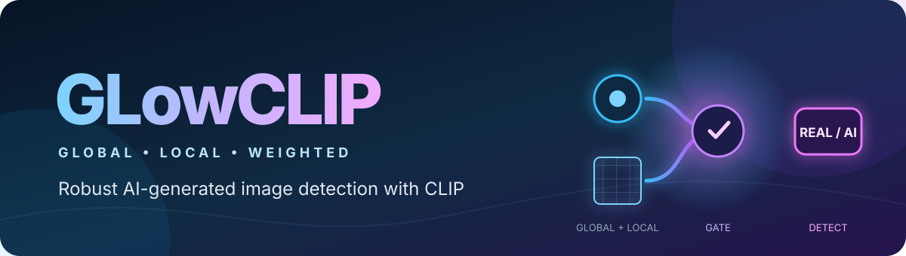
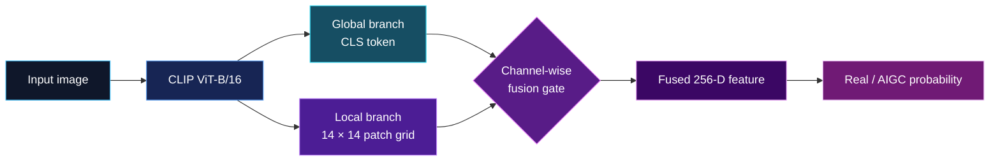

<p align="center">
  
</p>

<h1 align="center">GLowCLIP</h1>

<p align="center">
  <strong>Global–Local Weighted Feature Fusion for Robust AI-Generated Image Detection</strong>
</p>

<p align="center">
  
  
  
  
  
</p>

<p align="center">
  <a href="#quick-start">Quick start</a> ·
  <a href="https://huggingface.co/spaces/xhan0219/GLowCLIP">Live demo</a> ·
  <a href="#results-at-a-glance">Results</a> ·
  <a href="#how-it-works">Architecture</a> ·
  <a href="#training-and-evaluation">Train & evaluate</a> ·
  <a href="#documentation">Documentation</a>
</p>

GLowCLIP is a robust binary forensic classifier for distinguishing real images
from AI-generated images (`0 = Real`, `1 = AIGC`). It combines CLIP's global CLS
representation with local patch-token evidence, then learns how much to trust each
feature channel for every input image.

The name describes the model directly: **G**lobal + **Lo**cal + **W**eighted +
**CLIP**.

> [!IMPORTANT]
> **Your deployment images do not need labels, matched real/AI pairs, special
> filenames, or class folders.** Point `glowclip-predict` at any image or directory;
> every image is scored independently.

## Why GLowCLIP?

| Capability | What the repository provides |
|---|---|
| Global + local evidence | A CLS-token branch captures semantic/structural cues while a spatial patch branch captures local forensic traces. |
| Input-adaptive fusion | A learned 256-channel gate weights global and local evidence separately for every image. |
| Efficient fine-tuning | Rank-8 LoRA updates only the Q/V projections in the last four CLIP vision layers; the remaining backbone stays frozen. |
| Robustness training | Reference and online compound-degraded views share labels and are coupled with feature- and prediction-consistency losses. |
| Real-world inference | Recursive, unlabeled, unpaired folder inference supports JPEG, PNG, WebP, BMP, and TIFF. |
| Reproducible evaluation | Fixed-threshold held-out testing, subgroup metrics, pair-bootstrap confidence intervals, and machine-readable results are included. |

## Results at a glance

The selected epoch-5 checkpoint was fine-tuned with fresh LoRA adapters and heads
on `glow_dataset`. The public pretrained CLIP backbone was loaded from
cache; it was not retrained from random initialization.

### Held-out modified-image test split

The main test split contains the dataset's assigned degradation levels rather than
the optional clean-image tree: 3,268 images / 1,634 matched pairs, with the
validation-selected threshold frozen before test evaluation.

| Model | Accuracy | AUROC | AP | F1-score |
|---|---:|---:|---:|---:|
| **GLowCLIP (ours)** | **96.27%** | **0.9934** | **0.9940** | **96.26%** |
| ResNet | 87.34% | 0.9561 | 0.9555 | 88.09% |
| CLIP | 89.60% | 0.9614 | 0.9632 | 89.59% |
| NPR | 78.82% | 0.8836 | 0.8850 | 80.61% |
| VIB | 90.59% | 0.9693 | 0.9703 | 90.76% |

GLowCLIP additionally achieved **0.9929** transform-family × level macro
ROC-AUC and **96.08%** AIGC recall. Its values come from the repository's saved
held-out evaluation; the baseline values are the supplied results from the
original baseline run and were not recomputed during notebook adaptation.

See the [full training report](docs/TRAINING_REPORT.md) for confidence intervals,
subgroup results, and limitations.

## How it works



During training, each reference image is paired with an online compound-degraded
view. Both pass through the same network. The objective combines fused
classification, auxiliary global/local classification, cosine feature
consistency, and symmetric prediction consistency:

```text
L = L_fused + λ_aux L_aux + λ_feature L_feature + λ_prediction L_prediction
```

At inference time, only one forward pass per input image is required.

## Quick start

### 1. Install

Python 3.10 or later is required. Install the PyTorch build appropriate for your
hardware, then install GLowCLIP:

```bash
python -m venv .venv
source .venv/bin/activate
pip install torch
pip install -e .
```

For an RTX 50-series / Blackwell GPU, use a CUDA 12.8-or-newer PyTorch build. This
is one known-good setup:

```bash
pip install 'torch==2.7.1' --index-url https://download.pytorch.org/whl/cu128
pip install -e .
```

The public `openai/clip-vit-base-patch16` backbone is fetched from Hugging Face on
first use unless it is already cached. To use an existing local cache without any
download, prefix commands with:

```bash
HF_HUB_OFFLINE=1 TRANSFORMERS_OFFLINE=1
```

### 2. Add the checkpoint

Place the separately distributed trained checkpoint anywhere convenient, for
example:

```text
checkpoints/final_handoff_checkpoint_glow_dataset.pt
```

Checkpoints produced before the GLowCLIP rename remain compatible: their tensor
keys and model configuration did not change.

### 3. Predict your own images

A flat folder is enough:

```text
my_test_images/
├── IMG_0001.jpg
├── holiday-photo.png
├── upload_83.webp
└── any-name-is-fine.jpeg
```

```bash
glowclip-predict my_test_images/ \
  --checkpoint checkpoints/final_handoff_checkpoint_glow_dataset.pt \
  --output predictions.json
```

You can mix individual files and directories. Directory traversal is recursive:

```bash
glowclip-predict image.jpg first_directory/ second_directory/ \
  --checkpoint checkpoints/final_handoff_checkpoint_glow_dataset.pt \
  --output predictions.json
```

Each result includes the source path, AI-generated probability, predicted label,
and diagnostic mean fusion-gate value:

```json
{
  "threshold": 0.4474602938,
  "predictions": [
    {
      "path": "/data/upload_83.webp",
      "fake_probability": 0.982741,
      "prediction": "AIGC",
      "gate_mean": 0.331204
    }
  ]
}
```

EXIF orientation correction, RGB conversion, aspect-ratio-preserving
letterboxing, resizing, and CLIP normalization are automatic.

## Training and evaluation

### Supported training layout

Training and labeled evaluation use manifests and matched pairs so split leakage
can be audited:

```text
data/
├── images/
│   ├── train/pair_*/{real,ai}.*
│   ├── validation/pair_*/{real,ai}.*
│   └── test/pair_*/{real,ai}.*
└── manifests/{train,validation,test}.csv
```

Unlabeled inference does **not** require this layout; it is only for training and
metric-producing evaluation.

### Prepare the original archives

```bash
glowclip-prepare \
  --images-zip images.zip \
  --manifests-zip manifests.zip \
  --output-dir data \
  --verify-hashes
```

### Normalize `glow_dataset`

The normalizer creates a clean, non-destructive layout and can use hard links to
avoid duplicating image bytes:

```bash
glowclip-normalize-dataset \
  --source-root /path/to/glow_dataset \
  --output-root data/glow_dataset \
  --link-mode hardlink \
  --verify-hashes
```

The main training tree contains assigned transformed images. Optional clean and
evaluation-only trees are excluded from training.

### Fine-tune

```bash
HF_HUB_OFFLINE=1 TRANSFORMERS_OFFLINE=1 \
glowclip-train --config configs/glow_dataset.yaml
```

The default schedule is one head-only epoch followed by four joint LoRA epochs in
BF16. Override YAML values from the command line without modifying a config:

```bash
glowclip-train \
  --config configs/default.yaml \
  --set data.batch_size=8 \
  --set train.gradient_accumulation=4
```

Resume an interrupted run with `--resume outputs/glowclip/last.pt`.

### Evaluate labeled images

```bash
glowclip-evaluate \
  --checkpoint checkpoints/final_handoff_checkpoint_glow_dataset.pt \
  --manifest data/glow_dataset/manifests/test.csv \
  --image-root data/glow_dataset/images \
  --output-dir outputs/test
```

The checkpoint's validation-selected threshold is used by default. Do not pass
`--fit-threshold` when producing final test metrics.

## Repository map

```text
GLowCLIP/
├── assets/glowclip-banner.svg
├── configs/
│   ├── default.yaml
│   ├── glow_dataset.yaml
│   └── baselines.yaml
├── docs/
│   ├── GLOWCLIP_Method_Guide.md
│   ├── TRAINING_REPORT.md
│   ├── COMPLETE_HANDOFF_REPORT.md
│   └── BASELINES_ADAPTATION.md
├── glowclip/
│   ├── model.py
│   ├── degradations.py
│   ├── demo_degradations.py
│   ├── inference.py
│   ├── space_app.py
│   ├── normalize_dataset.py
│   ├── train.py
│   ├── evaluate.py
│   ├── predict.py
│   └── baselines/
├── results/                 # compact machine-readable result summaries
├── tests/
├── app.py
├── baselines_original.ipynb
├── MODEL_CARD.md
├── Makefile
└── pyproject.toml
```

The source repository intentionally excludes datasets, model caches, prediction
rows, and trained checkpoints.

## Adapted notebook baselines

The four models from `baselines_original.ipynb` are available as maintainable
modules: ImageNet-pretrained ResNet-18, frozen OpenCLIP ViT-B/32 + linear probe,
NPR, and a VIB head over frozen OpenCLIP ViT-L/14.

The reported baseline results are shown beside GLowCLIP in
[Results at a glance](#results-at-a-glance).

Their optional dependencies are listed separately and are **not** installed with
GLowCLIP:

```bash
pip install -r requirements-baselines.txt
glowclip-baseline-reproduction \
  --data-root /path/to/images \
  --baseline resnet18 \
  --output-dir outputs/baselines
```

Read the [baseline adaptation notes](docs/BASELINES_ADAPTATION.md) first.
The notebook was adapted statically; its baselines were not executed as part of
that adaptation.

## Development

Install development dependencies and run the complete local check:

```bash
pip install -e '.[dev]'
make check
```

The unit tests use a tiny dummy vision backbone. They do not download CLIP weights
or require a dataset.

## Documentation

| Document | Contents |
|---|---|
| [Method guide](docs/GLOWCLIP_Method_Guide.md) | Architecture, fusion mechanism, LoRA placement, degradation-aware loss, and implementation notes |
| [Model card](MODEL_CARD.md) | Intended use, training data summary, evaluation, limitations, and checkpoint identity |
| [Complete handoff report](docs/COMPLETE_HANDOFF_REPORT.md) | Consolidated data, training, testing, robustness, and delivery record |
| [Training report](docs/TRAINING_REPORT.md) | Main experiment, confidence intervals, subgroup analysis, and robustness results |

## Responsible use and limitations

GLowCLIP produces a probabilistic forensic signal, not proof of provenance.
Performance can shift with unseen generators, screenshots, recompression, editing,
camera pipelines, and source-domain changes. Generator and source are also partly
confounded in the training corpus. Do not use a single model score as the sole
basis for punitive, legal, authorship, or moderation decisions.

For the full scope of validated and unvalidated behavior, read the
[model card](MODEL_CARD.md).
