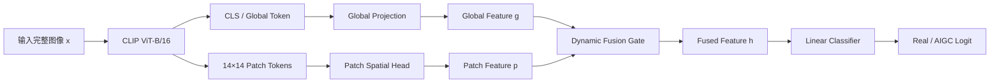
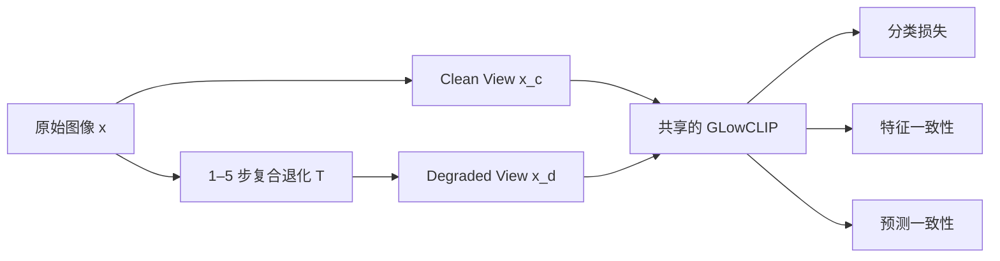

# GLowCLIP：基于全局—Patch 特征融合与 LoRA 微调的鲁棒 AIGC 图像检测

> **用途**：面向完整图像的二分类任务，输出 `Real` 或 `AIGC`。  
> **核心组成**：CLIP ViT-B/16、全局特征分支、Patch 空间特征分支、动态特征融合、LoRA 参数高效微调，以及 clean/degraded 一致性训练。  
> **计算约束**：模型总参数远低于 2B；默认只训练 LoRA 和轻量分类模块，不从头训练视觉主干。

---

## 1. 方法目标

给定一张可能经历裁剪、缩放、模糊、噪声、颜色变化和压缩等处理的完整图像，模型预测：

\[
y\in\{0,1\},\qquad
0=\text{Real},\quad 1=\text{AIGC}.
\]

训练阶段同时使用原始图像和其复合退化版本，但两者共享同一个真假标签：

\[
y(x)=y(T(x)).
\]

这里不是预测图像是否退化，也不是四分类；模型始终只执行 `Real/AIGC` 二分类。clean/degraded 配对的作用，是让真假判断在退化前后保持稳定。

本文档将该方法暂称为：

\[
\boxed{\text{GLowCLIP}}
\]

即 **Global–Local Feature Fusion CLIP**。

---

## 2. 方法概览



训练时，每张原图产生两个视图：



整体思想是：

1. 用 CLIP 的全局 token 建模内容与整体结构；
2. 用二维 patch token 建模分布在局部区域中的生成痕迹；
3. 根据当前图像动态融合两类证据；
4. 通过 LoRA 让 CLIP 表征适配 AIGC 检测，而不进行全参数训练；
5. 使用 clean/degraded paired training，使融合后的真假证据对复杂退化更稳定。

---

## 3. Backbone

### 3.1 推荐模型

默认使用：

\[
\boxed{\text{CLIP ViT-B/16}}
\]

推荐通过 Hugging Face 加载视觉编码器：

```python
from transformers import CLIPVisionModel

backbone = CLIPVisionModel.from_pretrained(
    "openai/clip-vit-base-patch16"
)
```

选择该实现的主要工程原因是：

- 可以直接获得最终层的 CLS token 和全部 patch tokens；
- self-attention 中的 `q_proj`、`v_proj` 是独立线性层，便于插入 LoRA；
- 参数规模较小，适合三天内完成训练和消融；
- 输入为 \(224\times224\) 时，可得到 \(14\times14=196\) 个 patch tokens。

### 3.2 Backbone 输出

对输入图像 \(x\)，CLIP ViT 输出：

\[
H(x)=\left[h_{\mathrm{cls}},h_1,\ldots,h_{196}\right],
\]

其中：

- \(h_{\mathrm{cls}}\in\mathbb R^{768}\)：全局 CLS token；
- \(h_i\in\mathbb R^{768}\)：第 \(i\) 个 patch token；
- patch token 可重排为 \(14\times14\) 的二维特征网格。

Hugging Face 输出对应为：

```python
outputs = backbone(pixel_values)
tokens = outputs.last_hidden_state      # [B, 197, 768]
cls_token = tokens[:, 0]                # [B, 768]
patch_tokens = tokens[:, 1:]            # [B, 196, 768]
```

不要只使用 `pooler_output`，因为该方法还需要原始 patch token。

---

## 4. 输入预处理

### 4.1 基础预处理

基础预处理只负责统一输入，不应无意中删除图像内容：

1. 解码为 RGB；
2. 删除 EXIF、ICC profile 等 metadata；
3. 保持完整画面，使用 padding/letterbox 补成正方形；
4. resize 到 \(224\times224\)；
5. 使用 CLIP 对应的均值和标准差归一化。

不建议固定使用 center crop，因为它可能移除图像边缘处的局部生成证据。裁剪应作为显式退化操作，而不是所有输入默认执行的预处理。

### 4.2 数据划分

先按照原始图片划分 train/validation/test，再在线产生退化版本。一个原图及其所有退化副本必须处于同一个 split，避免同源泄漏。

---

## 5. LoRA Fine-tuning

### 5.1 冻结范围

默认冻结：

- patch embedding；
- 前八个 Transformer blocks；
- 全部预训练 LayerNorm；
- CLIP 主干的其他参数。

训练：

- 最后四个 Transformer blocks 中的 LoRA；
- Global Projection；
- Patch Spatial Head；
- Fusion Gate；
- 三个分类头。

### 5.2 LoRA 插入位置

只在最后四个 Transformer blocks 的 Query 和 Value projection 中加入 LoRA：

\[
\boxed{\text{Layers }8,9,10,11\quad\times\quad\{Q,V\}}
\]

对原权重 \(W\)，LoRA 后为：

\[
W'=W+\frac{\alpha}{r}BA,
\]

其中：

\[
A\in\mathbb R^{r\times d_{\mathrm{in}}},\qquad
B\in\mathbb R^{d_{\mathrm{out}}\times r}.
\]

推荐配置：

| 参数 | 默认值 |
|---|---:|
| LoRA rank \(r\) | 8 |
| LoRA alpha \(\alpha\) | 16 |
| LoRA dropout | 0.05 |
| Target modules | `q_proj`, `v_proj` |
| Target layers | 最后 4 层 |

显存不足时使用：

\[
r=4,\qquad \alpha=8.
\]

### 5.3 PEFT 配置示例

不同 PEFT 版本对层筛选参数的支持可能略有差异。推荐配置逻辑如下：

```python
from peft import LoraConfig, get_peft_model

lora_config = LoraConfig(
    r=8,
    lora_alpha=16,
    lora_dropout=0.05,
    target_modules=["q_proj", "v_proj"],
    bias="none",
)

backbone = get_peft_model(backbone, lora_config)
```

如果当前 PEFT 版本无法直接限定最后四层，可采用以下任一方式：

- 先为所有 `q_proj/v_proj` 创建 LoRA，再冻结前八层的 LoRA 参数；
- 手动遍历模块，只替换 `vision_model.encoder.layers.8` 至 `.11`；
- 第一轮直接对所有 12 层 Q/V 使用 rank-4 LoRA，作为更容易落地的备选。

优先级为：

\[
\text{最后 4 层，rank 8}
>
\text{全部 12 层，rank 4}.
\]

### 5.4 参数规模

最后四层 Q/V、rank-8 LoRA 的参数量约为：

\[
4\times2\times2\times768\times8
\approx 98\text{K}.
\]

加上特征投影、Patch Head、Fusion Gate 和分类头后，新增可训练参数通常仍低于 1M。整个视觉模型约为数千万级参数，远低于 2B 限制。

---

## 6. Global Feature Branch

全局分支使用 CLS token：

\[
h_{\mathrm{cls}}\in\mathbb R^{768}.
\]

先经过线性投影、GELU 和 LayerNorm：

\[
g=
\operatorname{LN}
\left(
W_{g,2}\,
\operatorname{GELU}(W_{g,1}h_{\mathrm{cls}})
\right),
\]

其中：

\[
g\in\mathbb R^{256}.
\]

推荐结构：

```text
768 → 512 → GELU → Dropout(0.1) → 256 → LayerNorm
```

全局分支主要保留：

- 整体语义；
- 全局结构；
- 长距离区域关系；
- 对局部模糊或压缩相对稳定的高层证据。

定义一个辅助全局 logit：

\[
s_g(x)=w_g^\top g+b_g.
\]

该辅助 head 只在训练时提供额外监督，默认推理时使用融合输出。

---

## 7. Patch Spatial Feature Branch

### 7.1 恢复二维 Patch 网格

将 196 个 patch tokens 重排：

\[
P\in\mathbb R^{B\times196\times768}
\rightarrow
F_0\in\mathbb R^{B\times768\times14\times14}.
\]

```python
B, N, C = patch_tokens.shape
F0 = patch_tokens.transpose(1, 2).reshape(B, C, 14, 14)
```

### 7.2 轻量空间建模

使用 pointwise projection 和 depthwise convolution：

\[
F_1=\operatorname{Conv}_{1\times1}^{768\rightarrow256}(F_0),
\]

\[
F_2=F_1+
\operatorname{DWConv}_{3\times3}
\left(
\operatorname{GELU}(F_1)
\right).
\]

推荐实现：

```text
Conv 1×1, 768→256
GroupNorm(1, 256)
GELU
Depthwise Conv 3×3, groups=256
GELU
Residual Add
```

Depthwise convolution只在相邻 patch 之间传递信息，参数和 FLOPs 都很小，同时保留二维空间关系。

### 7.3 Patch 统计池化

仅做平均池化可能掩盖少量但关键的局部证据；仅做最大池化又容易被噪声或单个异常 patch 支配。因此推荐同时计算 patch 特征的均值和标准差：

\[
\mu=rac{1}{N}\sum_{i=1}^{N}F_{2,i},
\]

\[
\sigma=
\sqrt{
\frac{1}{N}
\sum_{i=1}^{N}
(F_{2,i}-\mu)^2+\epsilon
}.
\]

然后拼接：

\[
p=
\operatorname{LN}
\left(
W_p[\mu;\sigma]
\right),
\qquad
p\in\mathbb R^{256}.
\]

推荐结构：

```text
Mean Pool: 256
Std Pool: 256
Concat: 512
Linear: 512→256
GELU
LayerNorm
```

其中：

- \(\mu\) 描述局部生成证据在整图中的平均强度；
- \(\sigma\) 描述不同区域之间的证据分布和不均匀程度。

定义辅助 patch logit：

\[
s_p(x)=w_p^\top p+b_p.
\]

---

## 8. Global–Patch Feature Fusion

### 8.1 为什么不能只做简单相加

不同退化会对两类证据产生不同影响：

- blur、JPEG、downsampling 更容易破坏局部高频 patch cue；
- crop、遮挡或严重透视变换可能删除部分全局结构；
- color shift 对高层全局语义影响较小，但可能改变局部统计；
- 某些图像主要依赖全局不自然结构，另一些图像主要依赖局部纹理。

因此，不建议使用固定权重：

\[
h=\gamma g+(1-\gamma)p.
\]

推荐学习一个输入相关的通道级融合门。

### 8.2 Dynamic Fusion Gate

先构造融合输入：

\[
u=[g;p;|g-p|]\in\mathbb R^{768}.
\]

计算通道级 gate：

\[
a=
\sigma
\left(
W_{a,2}
\operatorname{GELU}(W_{a,1}u)
\right),
\qquad
a\in(0,1)^{256}.
\]

融合特征为：

\[
h=
\operatorname{LN}
\left(
a\odot g+(1-a)\odot p
\right).
\]

其中：

- \(a_j\rightarrow1\)：第 \(j\) 个通道更依赖全局特征；
- \(a_j\rightarrow0\)：第 \(j\) 个通道更依赖 patch 特征。

推荐 gate 网络：

```text
Concat[g, p, |g-p|]: 768
Linear: 768→128
GELU
Dropout(0.1)
Linear: 128→256
Sigmoid
```

最终分类 logit：

\[
s_f(x)=w_f^\top h+b_f.
\]

推理时使用：

\[
P(\text{AIGC}\mid x)=\sigma(s_f(x)).
\]

### 8.3 防止融合分支坍缩

动态 gate 可能在训练初期始终选择某一个分支。为降低这一风险：

- 为 global、patch 和 fused feature 各设置一个分类 head；
- 对三个输出都施加真假分类监督；
- 最终 fused head 权重最高；
- 不直接用 loss 强迫 \(g\) 和 \(p\) 完全相同，因为两者应保持互补。

---

## 9. 复合退化训练

### 9.1 Clean/Degraded 配对

对每张原始训练图像 \(x\)，产生：

\[
x_c=x,
\qquad
x_d=T(x).
\]

两者标签一致：

\[
y_c=y_d=y.
\]

训练时共享同一个 GLowCLIP 模型：

\[
(s_c,h_c,g_c,p_c)=F_\theta(x_c),
\]

\[
(s_d,h_d,g_d,p_d)=F_\theta(x_d).
\]

测试时不需要 clean/degraded pair，只输入待测图像一次。

### 9.2 Compound Degradation Chain

退化链定义为：

\[
T=t_n\circ t_{n-1}\circ\cdots\circ t_1,
\qquad n\in\{1,2,3,4,5\}.
\]

建议操作池：

| 类别 | 操作 |
|---|---|
| 几何与重采样 | RandomResizedCrop、aspect crop、rotation、perspective、downscale/upscale、pixelation |
| 模糊 | Gaussian blur、motion blur、defocus blur、median blur |
| 噪声 | Gaussian noise、shot/Poisson noise、speckle noise、impulse noise |
| 颜色与 Tone | brightness、contrast、saturation、hue、gamma、RGB shift、tone curve、quantization |
| 压缩 | JPEG、double JPEG、WebP、重复 resize–compress |

推荐 chain-length 分布：

| Chain 长度 | 采样概率 |
|---:|---:|
| clean | 15% |
| 1 | 20% |
| 2 | 25% |
| 3 | 20% |
| 4 | 12% |
| 5 | 8% |

即使已经显式构造 clean view，也可让 degraded branch 有约 15% 概率使用 identity/mild transform，避免训练分布全部偏向低质量图像。

### 9.3 退化采样原则

- real 和 AIGC 使用完全相同的退化操作分布；
- 不允许某类标签更常出现 JPEG、重模糊或低分辨率；
- severity 以 mild/medium 为主，heavy 约占 20%；
- 退化在线生成，每个 epoch 为同一原图采样不同 chain；
- 训练集与验证集可共享操作类别，但验证集应保留未见过的操作顺序、参数组合和较长 chain。

---

## 10. 训练损失

最终损失包括四部分：

\[
\boxed{
\mathcal L=
\mathcal L_{\mathrm{fused-cls}}
+\lambda_a\mathcal L_{\mathrm{aux-cls}}
+\lambda_f\mathcal L_{\mathrm{feat-cons}}
+\lambda_p\mathcal L_{\mathrm{pred-cons}}
}
\]

推荐初始权重：

\[
\lambda_a=0.2,
\qquad
\lambda_f=0.2,
\qquad
\lambda_p=0.1.
\]

这些数值是三天实验的推荐起点，应根据 validation robust AUC 调整。

### 10.1 Fused Classification Loss

对 clean 和 degraded view 的融合输出都执行 real/AIGC 分类：

\[
\mathcal L_{\mathrm{fused-cls}}
=
\frac12
\left[
\operatorname{BCE}(s_f(x_c),y)
+
\operatorname{BCE}(s_f(x_d),y)
\right].
\]

实现时使用：

```python
torch.nn.functional.binary_cross_entropy_with_logits
```

该项确保模型在两种输入状态下都预测正确，而不是只让两个错误预测保持一致。

### 10.2 Auxiliary Branch Classification Loss

分别监督 global 和 patch 分支：

\[
\begin{aligned}
\mathcal L_{\mathrm{aux-cls}}
=\frac14\big[&
\operatorname{BCE}(s_g(x_c),y)
+
\operatorname{BCE}(s_g(x_d),y)\\
&+
\operatorname{BCE}(s_p(x_c),y)
+
\operatorname{BCE}(s_p(x_d),y)
\big].
\end{aligned}
\]

作用：

- 防止 gate 永远忽略某一个分支；
- 确保 global 和 patch feature 各自保留真假判别能力；
- 提高融合训练的稳定性。

### 10.3 Fused Feature Consistency Loss

要求同一图像的 clean/degraded 融合特征保持接近：

\[
\mathcal L_{\mathrm{feat-cons}}
=
1-
\cos(h_c,h_d).
\]

其中：

\[
h_c=h(x_c),\qquad h_d=h(x_d).
\]

如果希望进一步约束两个分支，可使用：

\[
\mathcal L_{\mathrm{feat-cons}}^{+}
=
[1-\cos(h_c,h_d)]
+0.25[1-\cos(g_c,g_d)]
+0.25[1-\cos(p_c,p_d)].
\]

第一轮实验建议只对 fused feature 计算；只有在发现某一分支对退化极不稳定时，再加入分支级 consistency。

不要逐位置约束第 \(i\) 个 clean patch 与第 \(i\) 个 degraded patch，因为 crop、rotation 和 perspective 会改变 patch 的空间对应关系。

### 10.4 Prediction Consistency Loss

将 logit 转换为 Bernoulli 分布：

\[
q(x)=\sigma(s_f(x)),
\]

\[
P(x)=[1-q(x),q(x)].
\]

使用对称 KL divergence：

\[
\operatorname{SKL}(P_c,P_d)
=
\frac12
\left[
D_{\mathrm{KL}}(P_c\Vert P_d)
+
D_{\mathrm{KL}}(P_d\Vert P_c)
\right].
\]

因此：

\[
\mathcal L_{\mathrm{pred-cons}}
=
\operatorname{SKL}(P(x_c),P(x_d)).
\]

实现时将概率 clamp 到：

\[
[10^{-6},1-10^{-6}],
\]

防止数值不稳定。

这一项直接约束：

\[
P(\text{AIGC}\mid x_c)
\approx
P(\text{AIGC}\mid x_d).
\]

### 10.5 推荐最终损失

首轮训练使用：

\[
\boxed{
\mathcal L=
\mathcal L_{\mathrm{fused-cls}}
+0.2\mathcal L_{\mathrm{aux-cls}}
+0.2\mathcal L_{\mathrm{feat-cons}}
+0.1\mathcal L_{\mathrm{pred-cons}}
}
\]

在训练前 10% steps 内，将三个辅助项的权重从 0 线性 warm up 到目标值：

\[
\lambda(t)=
\lambda_{\mathrm{target}}
\min\left(1,\frac{t}{0.1T}\right).
\]

这样先建立基本真假边界，再逐步加入融合稳定性和退化一致性约束。

---

## 11. 数据量建议

数据量指独立原始图片，不包含在线生成的退化 view。

| 规模 | Real | AIGC | 总原图 |
|---|---:|---:|---:|
| 最低可运行 | 5,000 | 5,000 | 10,000 |
| 推荐 | 15,000–25,000 | 15,000–25,000 | 30,000–50,000 |
| 推荐中心值 | 20,000 | 20,000 | 40,000 |

对于固定 DALL·E 系列生成源，推荐先用：

\[
\boxed{20\text{K Real}+20\text{K AIGC}}
\]

每个 epoch 都在线重采样退化链，因此 40K 原图足以产生大量不同训练视图。

比继续无上限增加数据量更重要的是：

- real/fake 内容类别平衡；
- 文件格式和分辨率分布平衡；
- 退化类型和严重度平衡；
- parent-image-level 无泄漏划分。

---

## 12. 推荐训练流程

### 12.1 Stage A：只训练新 Head

持续约 1 epoch：

- 冻结整个 CLIP，包括 LoRA；
- 只训练 global projection、patch head、fusion gate 和 classifier；
- 先让三个分支建立基本真假分类能力。

推荐学习率：

\[
5\times10^{-4}.
\]

### 12.2 Stage B：启用 LoRA 联合训练

持续 3–5 epochs：

- 启用最后四层 Q/V LoRA；
- 同时训练全部新增 head；
- 使用完整复合退化与一致性损失。

推荐优化参数：

| 项目 | 推荐值 |
|---|---:|
| Optimizer | AdamW |
| LoRA learning rate | \(1\times10^{-4}\) |
| Heads learning rate | \(5\times10^{-4}\) |
| Weight decay | 0.01 |
| Warm-up | 总 steps 的 5%–10% |
| LR schedule | Cosine decay |
| Gradient clipping | 1.0 |
| Precision | BF16；不支持时 FP16 |
| Epochs | Head warm-up 1 + joint 3–5 |

### 12.3 Batch 组织

若原始 batch size 为 \(B\)，每张图生成 clean/degraded 两个 view，则实际 backbone 输入为 \(2B\)。

显存不足时：

- 原始 batch size 设为 8 或 16；
- 使用 gradient accumulation 获得等效 batch 32 或 64；
- 开启 gradient checkpointing；
- BF16 优先于 FP16。

---

## 13. 前向传播伪代码

```python
class GLowCLIP(nn.Module):
    def __init__(self, clip_vision):
        super().__init__()
        self.backbone = clip_vision

        self.global_proj = nn.Sequential(
            nn.Linear(768, 512),
            nn.GELU(),
            nn.Dropout(0.1),
            nn.Linear(512, 256),
            nn.LayerNorm(256),
        )

        self.patch_reduce = nn.Sequential(
            nn.Conv2d(768, 256, kernel_size=1),
            nn.GroupNorm(1, 256),
            nn.GELU(),
        )
        self.patch_dwconv = nn.Conv2d(
            256, 256, kernel_size=3, padding=1, groups=256
        )
        self.patch_proj = nn.Sequential(
            nn.Linear(512, 256),
            nn.GELU(),
            nn.LayerNorm(256),
        )

        self.fusion_gate = nn.Sequential(
            nn.Linear(256 * 3, 128),
            nn.GELU(),
            nn.Dropout(0.1),
            nn.Linear(128, 256),
            nn.Sigmoid(),
        )
        self.fused_norm = nn.LayerNorm(256)

        self.global_cls = nn.Linear(256, 1)
        self.patch_cls = nn.Linear(256, 1)
        self.fused_cls = nn.Linear(256, 1)

    def forward(self, pixel_values):
        out = self.backbone(pixel_values=pixel_values)
        tokens = out.last_hidden_state

        cls_token = tokens[:, 0]       # [B, 768]
        patch_tokens = tokens[:, 1:]   # [B, 196, 768]

        # Global branch
        g = self.global_proj(cls_token)  # [B, 256]

        # Patch branch
        b, n, c = patch_tokens.shape
        side = int(n ** 0.5)
        fmap = patch_tokens.transpose(1, 2).reshape(b, c, side, side)
        fmap = self.patch_reduce(fmap)
        fmap = fmap + F.gelu(self.patch_dwconv(fmap))

        mu = fmap.mean(dim=(2, 3))
        std = fmap.var(dim=(2, 3), unbiased=False).add(1e-6).sqrt()
        p = self.patch_proj(torch.cat([mu, std], dim=-1))

        # Dynamic fusion
        gate_input = torch.cat([g, p, torch.abs(g - p)], dim=-1)
        a = self.fusion_gate(gate_input)
        h = self.fused_norm(a * g + (1.0 - a) * p)

        return {
            "fused_logit": self.fused_cls(h).squeeze(-1),
            "global_logit": self.global_cls(g).squeeze(-1),
            "patch_logit": self.patch_cls(p).squeeze(-1),
            "fused_feature": h,
            "global_feature": g,
            "patch_feature": p,
            "gate": a,
        }
```

---

## 14. Loss 伪代码

```python
def binary_distribution(logits, eps=1e-6):
    q = torch.sigmoid(logits).clamp(eps, 1.0 - eps)
    return torch.stack([1.0 - q, q], dim=-1)


def symmetric_kl(p, q):
    kl_pq = (p * (p.log() - q.log())).sum(dim=-1)
    kl_qp = (q * (q.log() - p.log())).sum(dim=-1)
    return 0.5 * (kl_pq + kl_qp).mean()


def cosine_consistency(z1, z2):
    z1 = F.normalize(z1, dim=-1)
    z2 = F.normalize(z2, dim=-1)
    return (1.0 - (z1 * z2).sum(dim=-1)).mean()


def glowclip_loss(clean_out, degraded_out, labels,
                  lambda_aux=0.2,
                  lambda_feat=0.2,
                  lambda_pred=0.1):
    labels = labels.float()

    fused_cls = 0.5 * (
        F.binary_cross_entropy_with_logits(
            clean_out["fused_logit"], labels
        )
        + F.binary_cross_entropy_with_logits(
            degraded_out["fused_logit"], labels
        )
    )

    aux_cls = 0.25 * (
        F.binary_cross_entropy_with_logits(
            clean_out["global_logit"], labels
        )
        + F.binary_cross_entropy_with_logits(
            degraded_out["global_logit"], labels
        )
        + F.binary_cross_entropy_with_logits(
            clean_out["patch_logit"], labels
        )
        + F.binary_cross_entropy_with_logits(
            degraded_out["patch_logit"], labels
        )
    )

    feat_cons = cosine_consistency(
        clean_out["fused_feature"],
        degraded_out["fused_feature"],
    )

    p_clean = binary_distribution(clean_out["fused_logit"])
    p_degraded = binary_distribution(degraded_out["fused_logit"])
    pred_cons = symmetric_kl(p_clean, p_degraded)

    total = (
        fused_cls
        + lambda_aux * aux_cls
        + lambda_feat * feat_cons
        + lambda_pred * pred_cons
    )

    return {
        "loss": total,
        "fused_cls": fused_cls.detach(),
        "aux_cls": aux_cls.detach(),
        "feat_cons": feat_cons.detach(),
        "pred_cons": pred_cons.detach(),
    }
```

---

## 15. 推理流程

推理只需要一张完整图像：

\[
x\rightarrow\text{GLowCLIP}\rightarrow s_f(x).
\]

计算：

\[
p_{\mathrm{fake}}=\sigma(s_f(x)).
\]

默认阈值可设为 0.5，但正式提交应在 validation set 上确定一个全局阈值。不能针对每种退化分别选择阈值。

推荐输出：

```json
{
  "fake_probability": 0.8731,
  "prediction": "AIGC"
}
```

默认不使用 test-time augmentation，保证单次前向速度。若时间允许，可额外测试原图与水平翻转的平均分数，但必须在消融中单独报告。

---

## 16. 模型选择与监控指标

不要只根据 clean accuracy 选择 checkpoint。推荐优先级：

1. validation robust ROC-AUC；
2. worst-group ROC-AUC；
3. chain length 4–5 的 ROC-AUC；
4. clean ROC-AUC；
5. clean-to-degraded performance drop。

建议保存：

- `best_robust_auc.pt`；
- `best_worst_group.pt`；
- `last.pt`。

同时监控 gate：

\[
\bar a=\frac{1}{Bd}\sum_{b,j}a_{b,j}.
\]

如果长期出现：

- \(\bar a>0.95\)：模型几乎只使用 global branch；
- \(\bar a<0.05\)：模型几乎只使用 patch branch；

应检查辅助分类权重、两个分支的学习率或特征尺度。

---

## 17. 最小可运行版本

如果三天时间非常紧，先实现以下版本：

1. CLIP ViT-B/16；
2. 最后四层 Q/V、rank-8 LoRA；
3. Global branch：CLS → Linear 256；
4. Patch branch：patch mean + std → Linear 256；
5. 固定拼接融合：\([g;p]\rightarrow\mathrm{MLP}\rightarrow s\)；
6. clean/degraded BCE；
7. fused feature cosine consistency。

最小版本损失：

\[
\mathcal L
=
\mathcal L_{\mathrm{fused-cls}}
+0.2\mathcal L_{\mathrm{feat-cons}}.
\]

在该版本稳定后，再依次加入：

1. depthwise spatial convolution；
2. dynamic fusion gate；
3. auxiliary branch classification；
4. prediction consistency。

---

## 18. 推荐最终配置

| 项目 | 最终建议 |
|---|---|
| Backbone | CLIP ViT-B/16 |
| 输入尺寸 | 224×224，保留完整画面 |
| Global feature | 最终层 CLS token |
| Patch feature | 14×14 patch grid + 1×1 projection + 3×3 depthwise conv + mean/std pooling |
| Fusion | 通道级 dynamic gate |
| LoRA | 最后 4 层 Q/V，rank 8，alpha 16，dropout 0.05 |
| 训练数据 | 推荐 20K real + 20K AIGC |
| Degradation | 1–5 步在线复合退化 |
| 主分类损失 | clean/degraded fused BCE |
| 辅助监督 | global/patch branch BCE |
| 鲁棒性约束 | fused feature cosine consistency + prediction symmetric KL |
| Optimizer | AdamW |
| LR | LoRA 1e-4；heads 5e-4 |
| 训练周期 | head warm-up 1 epoch；联合训练 3–5 epochs |
| 推理成本 | 单张图、单次 forward |

最终方法可简洁描述为：

> GLowCLIP uses a pretrained CLIP ViT-B/16 image encoder and inserts lightweight LoRA adapters into the query and value projections of its final Transformer blocks. The global CLS representation is combined with a spatial patch representation obtained from the final patch-token grid through a lightweight convolutional aggregation head. An input-dependent channel-wise gate dynamically fuses global structural evidence and local forensic evidence. During training, clean and compound-degraded views of each image share the same real/AIGC label, while feature- and prediction-consistency objectives encourage the fused representation to remain stable under sequential degradations. At inference time, the model requires only a single forward pass on the input image.
